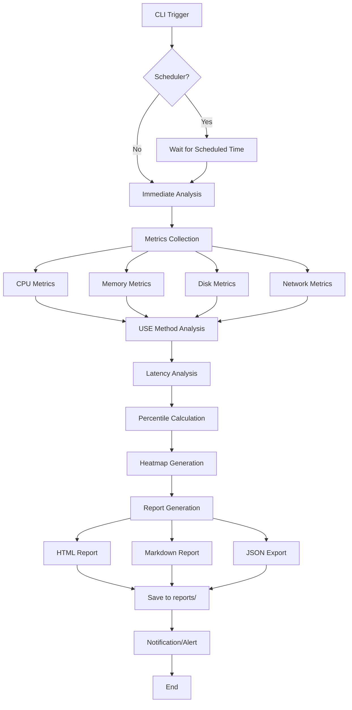
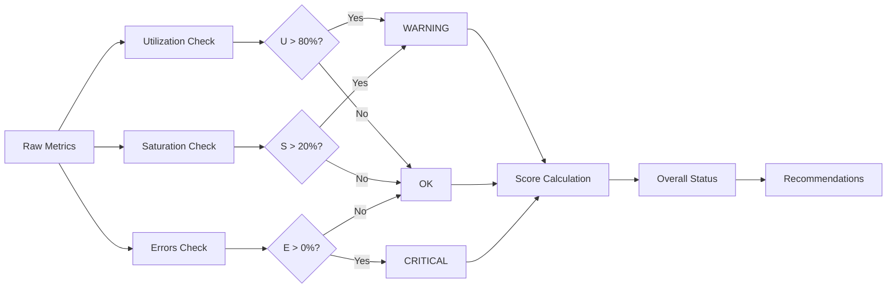
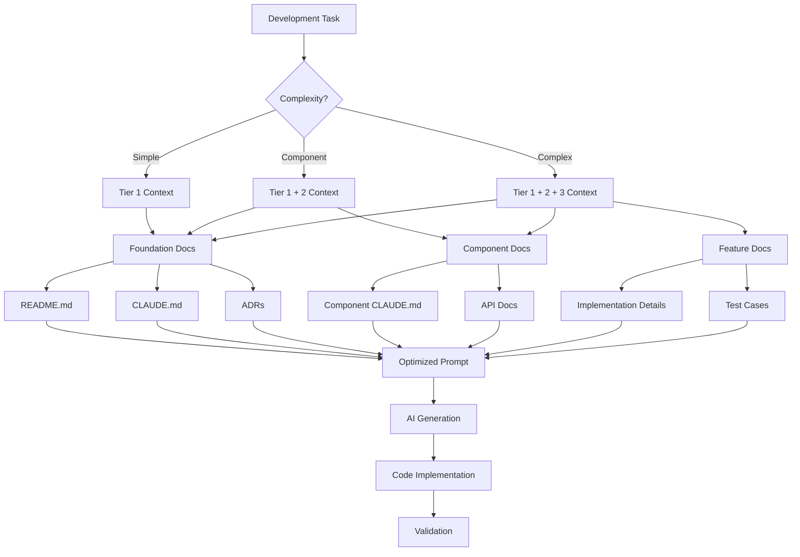
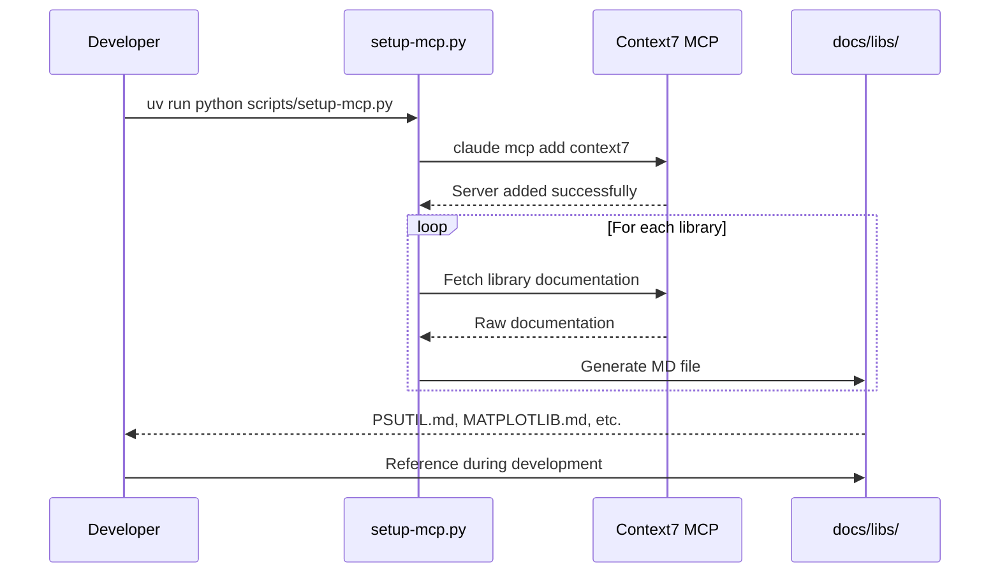
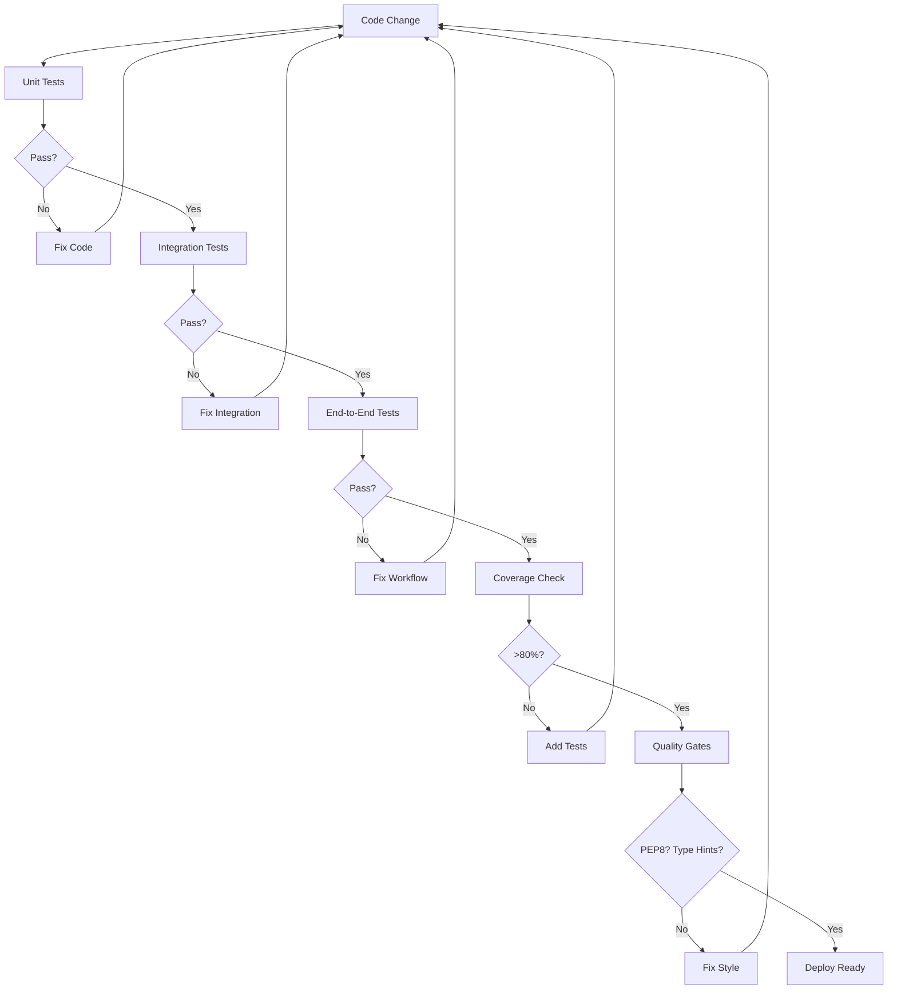
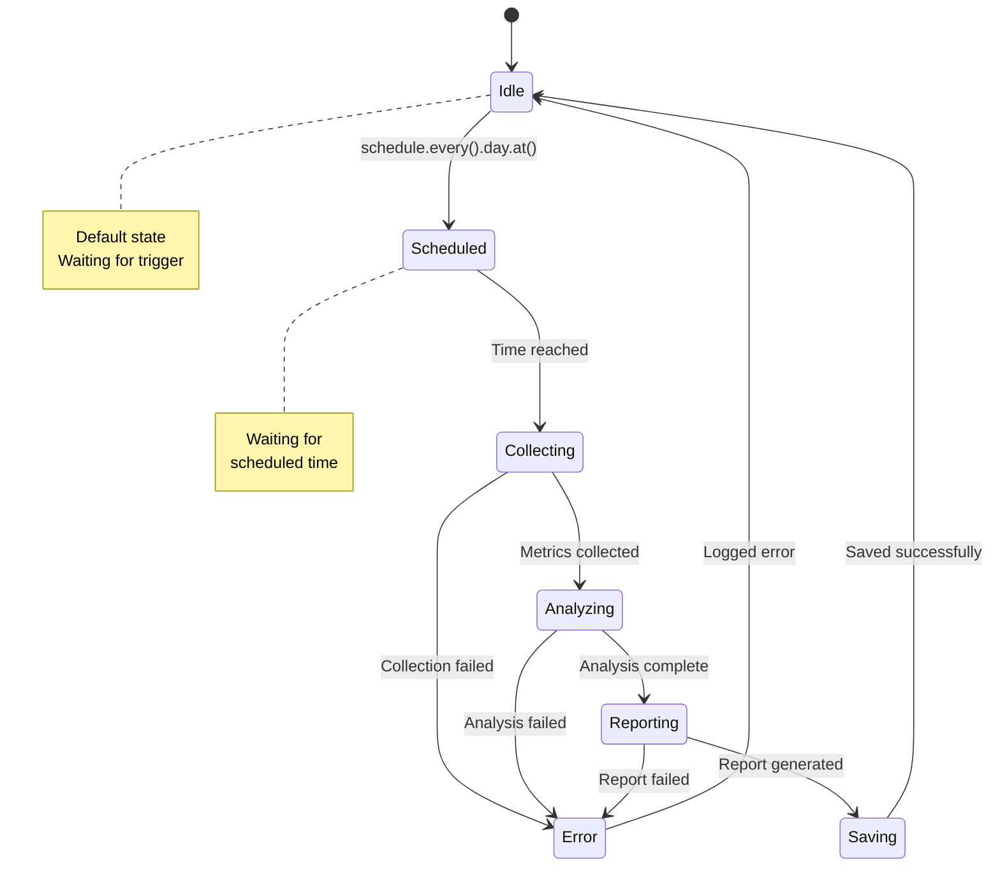
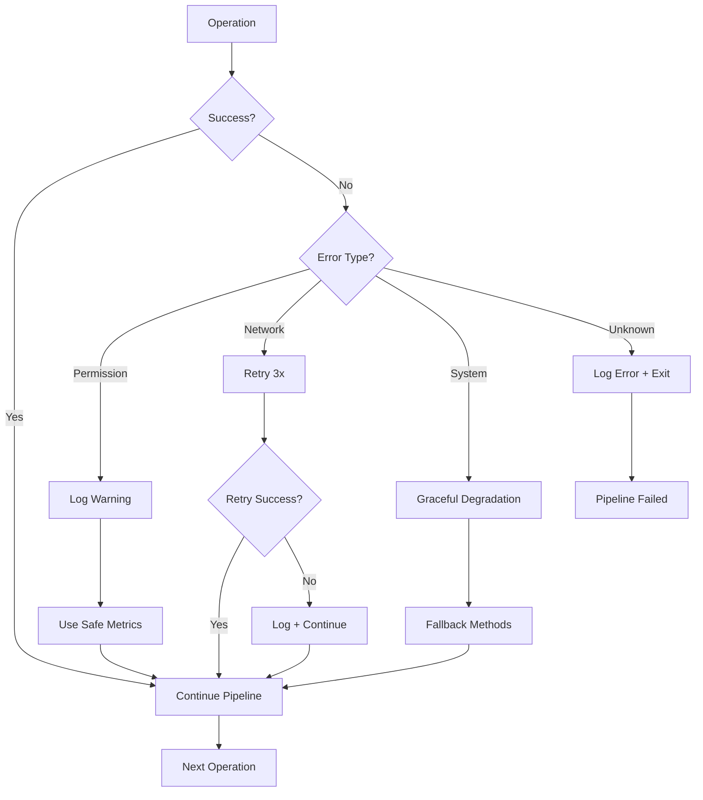
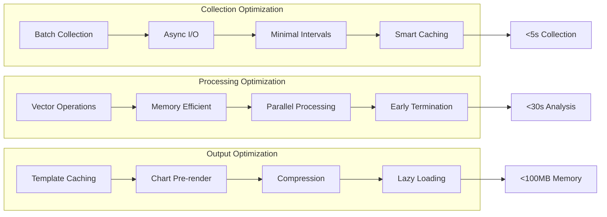

# Workflow Documentation - Systems Performance Analysis

## System Architecture Workflow



## USE Method Analysis Flow



## Context Engineering Workflow



## Data Pipeline Architecture

```mermaid
graph TB
    subgraph "Collection Layer"
        A[psutil CPU] --> D[Metrics Aggregator]
        B[psutil Memory] --> D
        C[psutil Disk/Network] --> D
        E[/proc filesystem] --> D
    end
    
    subgraph "Processing Layer"
        D --> F[USE Method Engine]
        F --> G[Latency Analyzer]
        G --> H[Score Calculator]
    end
    
    subgraph "Output Layer"
        H --> I[Report Generator]
        I --> J[HTML Template]
        I --> K[Markdown Template]
        I --> L[JSON Export]
        
        J --> M[matplotlib Charts]
        K --> N[Table Generation]
        L --> O[API Integration]
    end
    
    subgraph "Storage Layer"
        M --> P[reports/]
        N --> P
        O --> Q[Database/API]
    end
```

## MCP Integration Workflow



## Testing Strategy Workflow



## Scheduler Workflow



## Error Handling Workflow



## Performance Optimization Workflow



---

**Last Updated**: 2025-01-22
**Diagrams Generated**: Mermaid.js compatible
**View in**: GitHub, VSCode with Mermaid extension, or Mermaid Live Editor